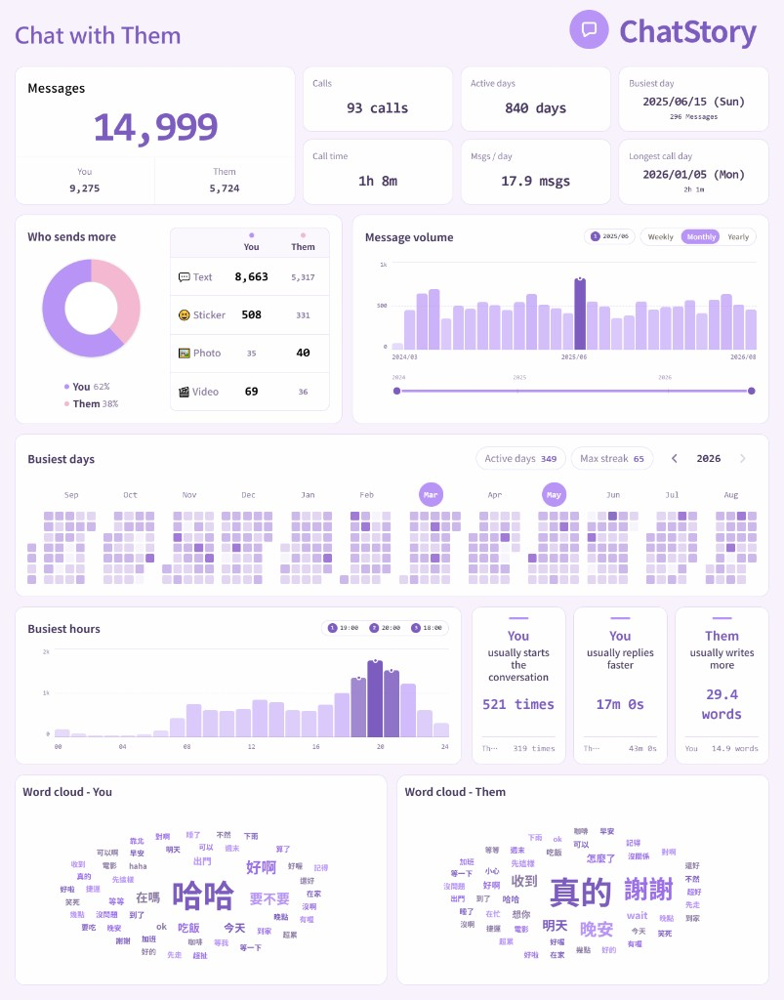

<div align="center">
  <p>
    
    
  </p>

Turn your chats into stories you can explore.

[](https://f964966828.github.io/ChatStory/)
[](LICENSE)
[](#deploy-locally)

</div>

Currently supported: **LINE**, plus **Meta** (Messenger, Instagram, and Threads). More platforms may come later.

<div align="center">
  
</div>

## Features

- **Privacy policy**: We don't upload anything when you import a chat. Parsing and charts run on your device; the file never leaves the browser.
- **Interactive charts**: We designed many interactions between the charts. Enjoy exploring your own story.
- **Side chat panel**: Open the actual messages next to the dashboard, jump to a busy day, and anonymize names before you share.
- **Share a snapshot**: Export the dashboard as a PNG. No extra caption text.
- **Responsive design**: The site is built to view on both phones and computers.
- **Chinese and English UI**: Switch language without leaving the page.

## Architecture

ChatStory is a Next.js App Router app with a static export (`output: "export"`). There is no API and no database.

Data flows in four stages: **file checks → platform parser → local analysis → dashboard**.

| Layer | Path | Role |
| --- | --- | --- |
| Routes | `src/app/` | Home, changelog, import guides |
| Shell | `src/components/` | Landing, dashboard layout, chat panel, i18n |
| Charts | `src/components/dashboard/` | One file per visualization, plus share-image export |
| Domain | `src/lib/` | Import, LINE/Meta parsers, stats, word tokenization |
| Tests | `tests/` | Parser unit tests, kept out of `src/lib/` |

```
src/
├── app/                  # Static pages
├── components/
│   ├── Landing.tsx       # File drop
│   ├── Dashboard.tsx     # Layout, share, chat panel
│   ├── ChatProvider.tsx  # Chats kept in memory
│   └── dashboard/        # Charts
└── lib/
    ├── import-chat.ts    # Type / size checks
    ├── parse/            # LINE .txt and Meta .json
    ├── analyze.ts        # Stats
    └── words.ts          # Word clouds
tests/
└── parse/                # LINE and Meta parser tests
```

## Deploy locally

### Requirements

- Node.js 22
- npm

### Deploy

```bash
# Clone the repo
git clone https://github.com/f964966828/ChatStory.git

# Change directory
cd ChatStory

# Install dependencies
npm install

# Start the dev server
npm run dev

# Open localhost:3000 and you'll see
```

### Test

Parser tests live in `tests/parse/`. After `npm install`:

```bash
# Run all tests
npm test

# Run one file
npx vitest run tests/parse/line.test.ts
npx vitest run tests/parse/meta.test.ts
```

## Contributing

Pull requests are welcome.

<table>
  <thead>
    <tr>
      <th nowrap>Type</th>
      <th nowrap>Start with</th>
      <th>Notes</th>
    </tr>
  </thead>
  <tbody>
    <tr>
      <td nowrap>Functionality issue</td>
      <td nowrap>Issue or PR</td>
      <td>A bug in import, charts, or display. Say what broke and how you checked the fix.</td>
    </tr>
    <tr>
      <td nowrap>Typos and wording</td>
      <td nowrap>Issue or PR</td>
      <td>README, UI text, import guides, or Chinese / English phrasing.</td>
    </tr>
    <tr>
      <td nowrap>New feature</td>
      <td nowrap>Issue first</td>
      <td>New chart, group chats, another platform, or a large UI / data-flow change.</td>
    </tr>
  </tbody>
</table>

Share a proposal on the issue first. A pull request opened before discussion will not be approved.

 
